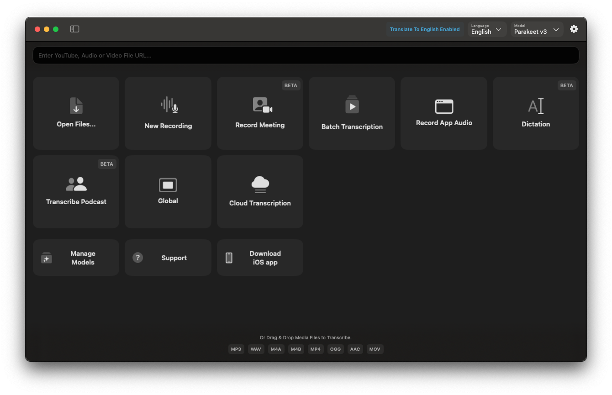
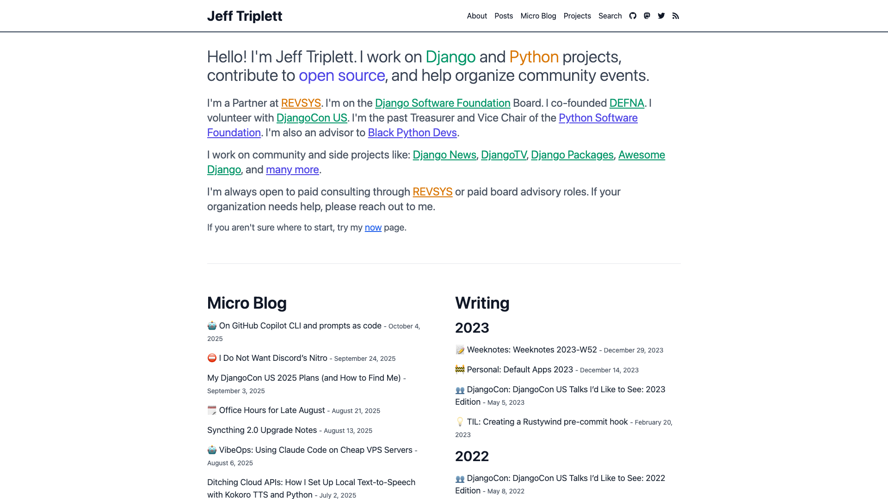
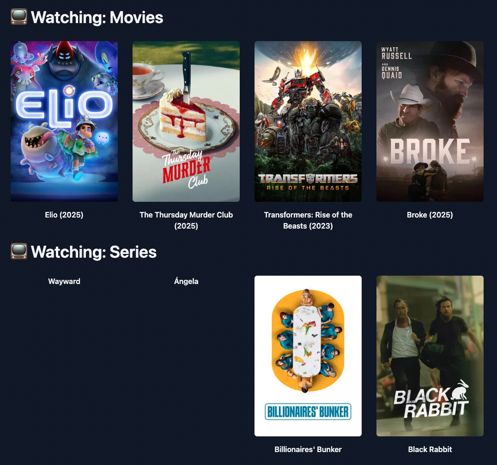
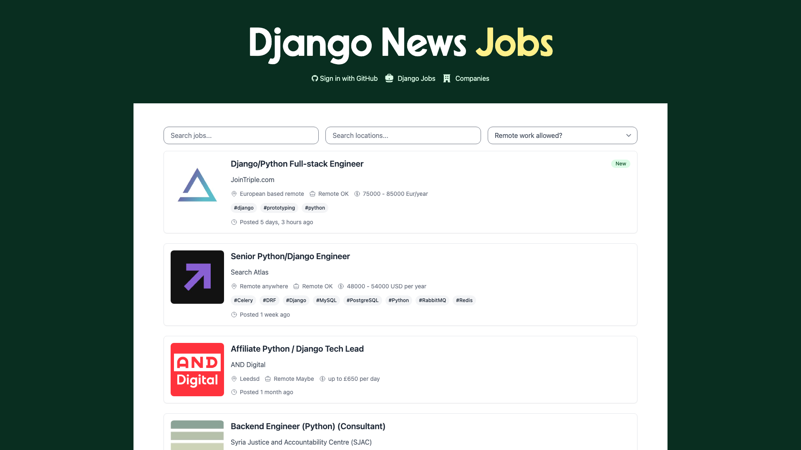

build-lists: true
footer: PyTexas 2025-10-07  - Jeff Triplett - @webology
<!-- // # theme: Fira, 5 -->

# PyTexas Presentation

## Exploring Claude Code and Agentic Frameworks

> Jeff Triplett (@webology)

October 7th, 2025

---

<!--[[[cog
from pathlib import Path

# Use glob to find all markdown files, excluding README.md
for file_path in sorted(Path("./slides").glob("*.md")):
    if file_path.name != "README.md":
        content = file_path.read_text()
        cog.out(content)
        cog.out('\n---\n\n')
]]]-->
# Who am I?

## Jeff Triplett

> @webology
>
> Partner / Engineer
> https://revsys.com

I work in Lawrence, KS

👨‍💻👩‍🔬👦👧🐶

---

## Current Affiliations

- Django Software Foundation (DSF) Director
- Black Python Devs Advisor
- DEFNA Co-founder
- DjangoCon US organizer
- Python Fellow

---

## Previous Affiliations

Python Software Foundation (PSF) Director, Vice Chair, and Teasurer

- DEFNA President
- DjangoCon US Chair

--- 

## Projects

- django-news.com (newsletter)
- Django News Jobs
- DjangoTV.com
- DjangoPackages.org
- Webrings and dozens and dozens more

---

# Disclosures...

- I pay $20/month to OpenAI for ChatGPT
- I pay $100/month to Anthropic for Claude Code

---

# Disclosures

- I have signed NDAs with Microsoft, GitHub, and Anthropic
- I am not paid to promote any products
- I have been in private betas for OpenAI, Anthropic, Copilot, and other tools which came up
- I do receive free or discounted credits from these companies

---

## Claude Code


https://www.claude.com/product/claude-code

---

## There are too many AI tools


https://www.youtube.com/watch?v=tCGju2JB5Fw

---

## tl;dr My favorite is Claude Code

## Alternatives

- **Codex** is OpenAI's CLI product
- **Cursor CLI** is Cursor's CLI product
- **GitHub Copilot CLI** is GitHub's CLI product

^ Codex (OpenAI) is really good too and probably not worth switcing
^ GitHub Copilot CLI is new and can work with both OpenAI and Anthropic's models

---

## "C" is for LLM CLI tools apparently

| name | company | models |
| --- | --- | --- |
| Claude Code | Anthropic | Anthropic only |
| Codex | OpenAI | OpenAI only |
| Copilot CLI | GitHub | Anthropic or OpenAI |
| Cursor CLI | Cursor | Any |

---

## Section 1: Claude Code for Non-Code

---

> Agent - An LLM agent runs tools in a loop to achieve a goal.
>
> Simon Willison

---

## Case Study: Claude Code with voice notes




https://goodsnooze.gumroad.com/l/macwhisper

---


---

## Voice Notes

- Record on your phone with Voice Notes
- Record on your computer with MacWhisper or Super whisper
- Transcode via MacWhisper

---

## Cleaning Voice Transcripts

- Record rough notes in the morning
- Drop into Obsidian vault
- Run Claude Code to clean up transcripts
- Quick, effective formatting and cleanup

---

## Live Demo

---

:bulb: Claude Code is really good at working with static markdown files like blog posts and Obsidian notes.

:bulb: Voice mode is incredibly powerful

---

# Custom Commands

## Slash Commands

- Create custom prompts for repeated tasks
- Basic but highly extensible
- Easy to customize for your workflow
- Makes routine tasks faster

---

## `/clean_filler_words`

```shell
➜ cat ~/.claude/commands/clean_filler_words.md

Please review the following text and remove filler words like 'um,' 'uh,' and any unnecessary repetitions. 
Keep the sentences clear and concise.

# accessible as "/clean_filler_words" in Claude Code...
```

---

# Case Study: jefftriplett.com




https://jefftriplett.com

^ I maintain a now page and a few months back that I have to run a python script on every week.

---


---

# My /now/ page



---

My prompt:

> Please run "git pull" and add covers for any missing movies or series you find.

---

## Demo

---

# Case Study: UpgradeDjango.com


https://UpgradeDjango.com

---

There should be one easy and obvious to know which version of Django to use.


---

- Built by humans
- Maintained by Claude Code
- Built with Hugo: https://gohugo.io

---

## Hugo for DjangoUpgrade.com

- Static website generator
- Single binary file - no dependencies
- Cross-platform compatibility
- No-code solution for static hosting
- Alternative to Ruby/Python generators

---

# Big Unlock: URL Reading

## Beyond File Operations

- Instead of: "Open this JSON file"
- Better: "Read this website URL"
- Claude Code can fetch and parse web content
- Update local files based on live data

---

# Django security release blog post


---

# Our prompt

> Please read https://www.djangoproject.com/weblog/2025/oct/01/security-releases/ and then update our Django 5.2, 5.1, and 4.2 files.


---

### Demo


---

# Code Changes


--- 

```diff
diff --git a/data/releases/5.2.json b/data/releases/5.2.json
index 9955141..f283b22 100644
--- a/data/releases/5.2.json
+++ b/data/releases/5.2.json
@@ -8,7 +8,7 @@
     "released": "2025-04-02",
     "end_of_support": "2028-04-01",
     "end_of_extended_support": "2029-04-01",
-    "latest_release": "5.2.5",
+    "latest_release": "5.2.7",
     "python_versions": [
         "3.10",
         "3.11",
@@ -16,6 +16,22 @@
         "3.13"
     ],
     "versions": [
+        {
+            "version": "5.2.7",
+            "released": "2025-10-01",
+            "release_type": "security",
+            "github_url": "https://github.com/django/django/releases/tag/5.2.7",
+            "release_notes_url": "https://docs.djangoproject.com/en/dev/releases/5.2.7/",
+            "blog_post_url": "https://www.djangoproject.com/weblog/2025/oct/01/security-releases/"
+        },
+        {
+            "version": "5.2.6",
+            "released": "2025-09-03",
+            "release_type": "bugfix",
+            "github_url": "https://github.com/django/django/releases/tag/5.2.6",
+            "release_notes_url": "https://docs.djangoproject.com/en/dev/releases/5.2.6/",
+            "blog_post_url": "https://www.djangoproject.com/weblog/2025/sep/03/bugfix-releases/"
+        },
         {
             "version": "5.2.5",
             "released": "2025-08-06",
```

---

## Section 2: Using Claude Code with Code

---

# How I view Agentic Coding

> Prompts are Code.

---

# Case Study: DjangoTV.com


https://DjangoTV.com

---

Django conference videos on YouTube doesn't get enough views.


---

- It is 99% vibe-coded. 
- I helped with the deployment bits

---

## Live Demo

Let's build a Topic model.

--- 

:bulb: If your project is on GitHub ask Claude Code to read issue #999 or check while pull request #999 is failing and fix it.

---

# Case Study: Django News Jobs




https://jobs.django-news.com

---

To promote Django and Python jobs to the Django community


---

## Django News Jobs

- Built by humans
- Django app
- Maintained by Claude Code
- Jobs use the Pydantic AI framework

---

## Demo

After we touch on Pydantic AI

---

## Pydantic AI Framework


https://ai.pydantic.dev

---

## What is it?

- Framework for building AI-powered applications
- Type-safe, structured outputs
- Built on Pydantic for data validation
- Works with multiple LLM providers

> The Django ORM of working with LLM providers.

---

## Django News Jobs Use Case

### Structured Data Benefits

- Predictable outputs
- Type safety
- Validation built-in
- Easy to test and maintain

---

## Our BaseModel

```python
from pydantic import BaseModel, Field
from pydantic_ai import Agent

class JobOutput(BaseModel):
    title: str = Field(
        description="The title of the job position.",
    )
    description: str = Field(
        description="A detailed description of the job responsibilities and requirements."
    )
    salary_range: list[str] = Field(
        description="The range of the salary offered for the position.",
    )
    location: str = Field(
        description="The job's location.",
    )
    is_django_job: bool = Field(
        description="Indicates if this job is a Django job.",
    )
    company: str = Field(
        description="The name of the company offering the job.",
    )

```

---

# Our prompt

```python
PROMPT: str = """<title>

{title}

</title>

<description>

{description}

</description>
"""
```

---

```python

def parse_job(pk: int):
	job = JobListing.objects.get(pk=pk)

	SYSTEM_PROMPT: str = "Extract the job information. If you aren't sure of an answer, return an empty value."

	prompt: str = PROMPT.format(title=job.title, description=job.description)

    agent = Agent(
        "openai:gpt-5-mini",
        output_type=JobOutput,
        system_prompt=SYSTEM_PROMPT,
    )
    result = agent.run_sync(prompt)

    print(result.output)

    print(result.usage())

```

---


```python
result.output.title='Backend Python Software Engineer (Hybrid)'                                                                                                          JobOutput(
JobOutput(
    title='Backend Python Software Engineer (Hybrid)',
    description="As a Python Developer, you will be responsible for designing, developing, and maintaining our web applications. This position offers the opportunity to
have a real impact in an influential, technology-focused company powering advanced data center simulation and design. You'll collaborate with the development team to
build web applications using Python and the Django framework, write clean and maintainable code, participate in code reviews, perform unit testing and debugging, and
work closely with product managers and architects to deliver scalable solutions.",
    compensation='',
    salary_range=[],
    benefits=[],
    location='Hybrid',
    is_django_job=True,
    company='NVIDIA'
)

Usage(requests=1, request_tokens=831, response_tokens=1021, total_tokens=1852, details={'accepted_prediction_tokens': 0, 'audio_tokens': 0, 'reasoning_tokens': 704,
'rejected_prediction_tokens': 0, 'cached_tokens': 0})

```

---

# Tips

:bulb: Use VibeTunnel: https://vibetunnel.sh

:bulb: Use Hooks to automate workflows: https://docs.claude.com/en/docs/claude-code/hooks

---

# Moar Resources

- Elite AI Assisted Coding: https://elite-ai-assisted-coding.dev
- Simon Willison's blog: https://simonwillison.net
- https://docs.claude.com/en/docs/agents-and-tools/tool-use/memory-tool

---

## Django's role in AI benchmarks

- https://blog.nilenso.com/blog/2025/09/25/swe-benchmarks/

---

# Colophon

These tools powered my presentation:

- https://github.com/fastapi/typer
- https://github.com/lincolnloop/python-qrcode
- https://github.com/nedbat/cog
- https://github.com/samuelcolvin/watchfiles
- https://github.com/simonw/shot-scraper
- https://www.deckset.com

---

<!--[[[end]]]-->
